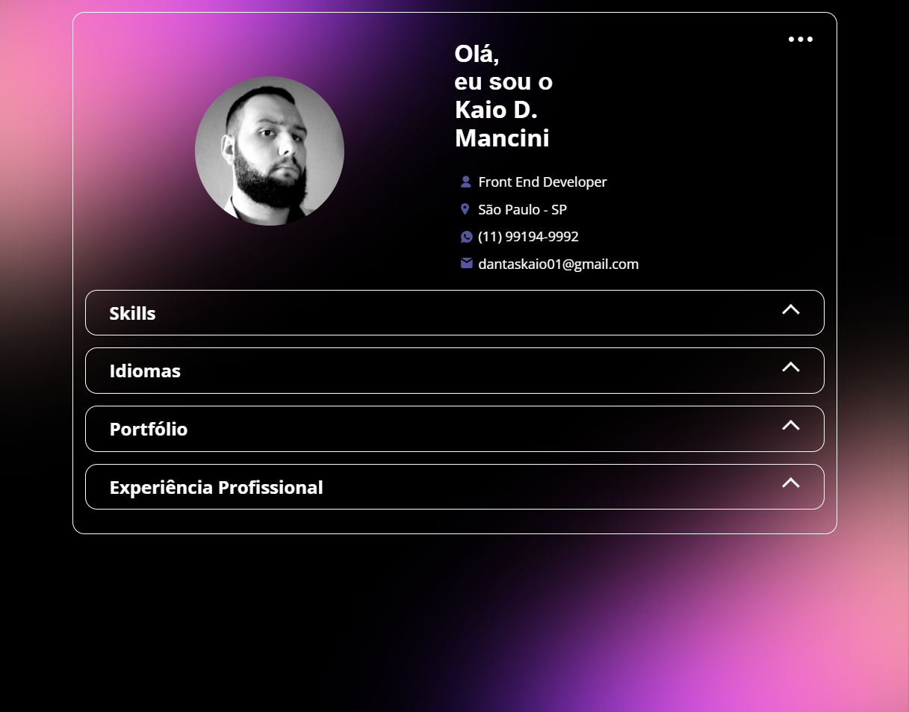

<h1 align="center">Portfólio - DIO </h1>

O projeto consite na construção de um Portfólio visando colocar todos os conhecimentos adquiridos na trilha de JavaScript da  <a href="https://www.dio.me/"> DIO</a>.

## Súmario

- [📦 Temas abordados](#topics)
- [🏆 Sobre](#sobre)

<h2 id="features">✨ Features </h2>

- HTML
- CSS
- Responsividade
- JavaScript

<h2 id="sobre">🏆 Sobre</h2>

Como desafio desse projeto foi construído um portfólio utilizando os conceitos de mobile first, nosso projeto consome a API do Git Hub, deixando todas as informações inseridas de forma dinâmica.